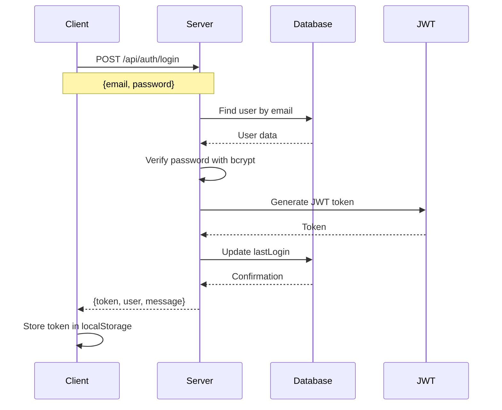
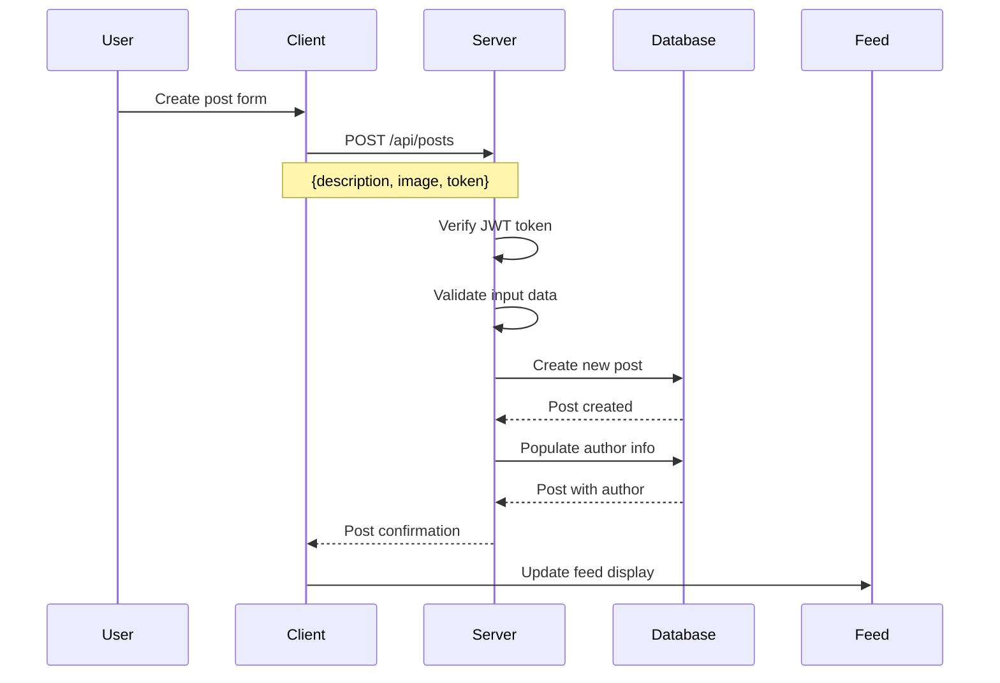
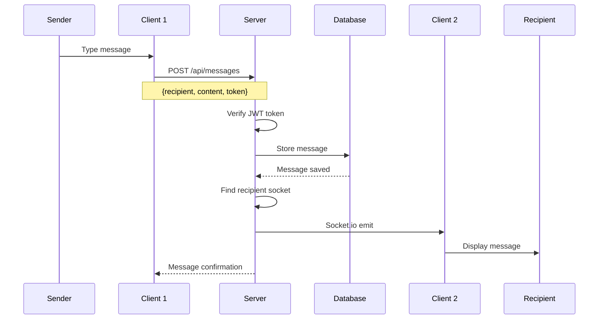
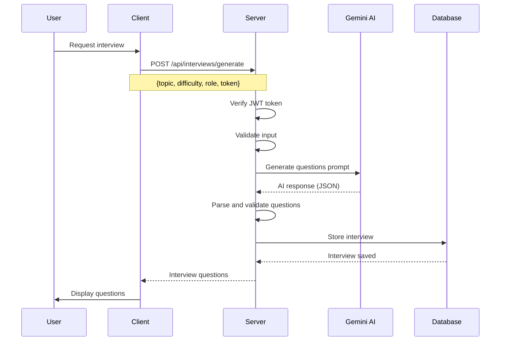

# AlumniLink - System Diagrams & Visual Documentation

## Table of Contents
1. [System Architecture Diagrams](#system-architecture-diagrams)
2. [Sequence Diagrams](#sequence-diagrams)
3. [Data Flow Diagrams](#data-flow-diagrams)
4. [Database Schema Diagrams](#database-schema-diagrams)
5. [Component Interaction Diagrams](#component-interaction-diagrams)

## System Architecture Diagrams

### 1. High-Level System Architecture
```
┌─────────────────────────────────────────────────────────────────────────────┐
│                              CLIENT LAYER                                  │
├─────────────────────────────────────────────────────────────────────────────┤
│  ┌─────────────┐  ┌─────────────┐  ┌─────────────┐  ┌─────────────┐      │
│  │   React     │  │   React     │  │   React     │  │   React     │      │
│  │  Router    │  │  Context    │  │ Components  │  │   Pages     │      │
│  └─────────────┘  └─────────────┘  └─────────────┘  └─────────────┘      │
│         │                │                │                │             │
│         └────────────────┼────────────────┼────────────────┘             │
│                          │                │                              │
│  ┌─────────────┐  ┌─────────────┐  ┌─────────────┐                      │
│  │   Axios     │  │ Socket.io   │  │ Tailwind    │                      │
│  │   HTTP     │  │   Client    │  │    CSS      │                      │
│  │   Client   │  │             │  │             │                      │
│  └─────────────┘  └─────────────┘  └─────────────┘                      │
└─────────────────────────────────────────────────────────────────────────────┘
                                    │
                                    ▼
┌─────────────────────────────────────────────────────────────────────────────┐
│                              NETWORK LAYER                                 │
├─────────────────────────────────────────────────────────────────────────────┤
│  ┌─────────────┐  ┌─────────────┐  ┌─────────────┐  ┌─────────────┐      │
│  │   HTTP     │  │   HTTPS     │  │   WebSocket │  │   CORS      │      │
│  │  Requests  │  │  Requests   │  │  Connection │  │  Policy     │      │
│  └─────────────┘  └─────────────┘  └─────────────┘  └─────────────┘      │
└─────────────────────────────────────────────────────────────────────────────┘
                                    │
                                    ▼
┌─────────────────────────────────────────────────────────────────────────────┐
│                              SERVER LAYER                                  │
├─────────────────────────────────────────────────────────────────────────────┤
│  ┌─────────────┐  ┌─────────────┐  ┌─────────────┐  ┌─────────────┐      │
│  │   Express  │  │   Socket.io │  │   Multer    │  │   CORS      │      │
│  │   Server   │  │    Server   │  │   File      │  │  Middleware │      │
│  └─────────────┘  └─────────────┘  └─────────────┘  └─────────────┘      │
│         │                │                │                │             │
│         └────────────────┼────────────────┼────────────────┘             │
│                          │                │                              │
│  ┌─────────────┐  ┌─────────────┐  ┌─────────────┐                      │
│  │   JWT      │  │   bcryptjs  │  │   Google    │                      │
│  │  Auth      │  │   Password  │  │   Gemini    │                      │
│  │ Middleware │  │   Hashing   │  │     AI      │                      │
│  └─────────────┘  └─────────────┘  └─────────────┘                      │
└─────────────────────────────────────────────────────────────────────────────┘
                                    │
                                    ▼
┌─────────────────────────────────────────────────────────────────────────────┐
│                              DATA LAYER                                    │
├─────────────────────────────────────────────────────────────────────────────┤
│  ┌─────────────┐  ┌─────────────┐  ┌─────────────┐  ┌─────────────┐      │
│  │  MongoDB   │  │  Mongoose   │  │   File      │  │   Indexes   │      │
│  │  Database  │  │     ODM     │  │  Storage    │  │             │      │
│  └─────────────┘  └─────────────┘  └─────────────┘  └─────────────┘      │
└─────────────────────────────────────────────────────────────────────────────┘
```

### 2. Component Architecture
```
┌─────────────────────────────────────────────────────────────────────────────┐
│                              FRONTEND COMPONENTS                           │
├─────────────────────────────────────────────────────────────────────────────┤
│                                                                             │
│  ┌─────────────────┐    ┌─────────────────┐    ┌─────────────────┐        │
│  │     App.js      │    │   AuthContext   │    │     Layout      │        │
│  │  (Main Router)  │───►│   (Context)     │───►│   (Wrapper)     │        │
│  └─────────────────┘    └─────────────────┘    └─────────────────┘        │
│           │                       │                       │                │
│           ▼                       ▼                       ▼                │
│  ┌─────────────────┐    ┌─────────────────┐    ┌─────────────────┐        │
│  │     Navbar      │    │     Sidebar     │    │     Pages       │        │
│  │  (Navigation)   │    │   (Menu)        │    │                 │        │
│  └─────────────────┘    └─────────────────┘    └─────────────────┘        │
│           │                       │                       │                │
│           └───────────────────────┼───────────────────────┘                │
│                                   │                                        │
│                                   ▼                                        │
│  ┌─────────────────┐    ┌─────────────────┐    ┌─────────────────┐        │
│  │   Dashboard     │    │     Profile     │    │     Search      │        │
│  │   (Home)        │    │   (Settings)    │    │   (Users)       │        │
│  └─────────────────┘    └─────────────────┘    └─────────────────┘        │
│           │                       │                       │                │
│           ▼                       ▼                       ▼                │
│  ┌─────────────────┐    ┌─────────────────┐    ┌─────────────────┐        │
│  │    Messages     │    │     Chatbot     │    │    Interview    │        │
│  │   (Chat)        │    │    (AI Help)    │    │   (Practice)    │        │
│  └─────────────────┘    └─────────────────┘    └─────────────────┘        │
└─────────────────────────────────────────────────────────────────────────────┘
```

## Sequence Diagrams

### 1. User Authentication Flow


### 2. Post Creation Flow


### 3. Real-time Messaging Flow


### 4. AI Interview Generation Flow


## Data Flow Diagrams

### 1. User Registration Data Flow
```
┌─────────────┐    ┌─────────────┐    ┌─────────────┐    ┌─────────────┐
│   User      │    │   Client    │    │   Server    │    │  Database   │
│             │    │             │    │             │    │             │
│ 1. Fill     │───►│ 2. Form     │───►│ 3. Validate │───►│ 4. Store    │
│   Form      │    │   Submit    │    │   Input     │    │   User      │
│             │    │             │    │             │    │             │
└─────────────┘    └─────────────┘    └─────────────┘    └─────────────┘
                                                              │
                                                              ▼
┌─────────────┐    ┌─────────────┐    ┌─────────────┐    ┌─────────────┐
│   JWT      │    │   Server    │    │   Client    │    │   User      │
│  Token     │◄───│ 5. Generate │◄───│ 6. Return   │◄───│ 7. Created │
│             │    │   Token     │    │   Response  │    │             │
└─────────────┘    └─────────────┘    └─────────────┘    └─────────────┘
```

### 2. Post Creation Data Flow
```
┌─────────────┐    ┌─────────────┐    ┌─────────────┐    ┌─────────────┐
│   User      │    │   Client    │    │   Server    │    │  Database   │
│             │    │             │    │             │    │             │
│ 1. Write    │───►│ 2. Form     │───►│ 3. Auth     │───►│ 4. Store    │
│   Post      │    │   Submit    │    │   Check     │    │   Post      │
│             │    │             │    │             │    │             │
└─────────────┘    └─────────────┘    └─────────────┘    └─────────────┘
                                                              │
                                                              ▼
┌─────────────┐    ┌─────────────┐    ┌─────────────┐    ┌─────────────┐
│   Feed      │    │   Client    │    │   Server    │    │  Database   │
│  Update     │◄───│ 5. Display  │◄───│ 6. Return   │◄───│ 7. Post    │
│             │    │   Post      │    │   Post      │    │  Stored     │
└─────────────┘    └─────────────┘    └─────────────┘    └─────────────┘
```

### 3. Messaging Data Flow
```
┌─────────────┐    ┌─────────────┐    ┌─────────────┐    ┌─────────────┐
│  Sender     │    │   Client    │    │   Server    │    │  Database   │
│             │    │             │    │             │    │             │
│ 1. Type     │───►│ 2. Send     │───►│ 3. Store    │───►│ 4. Save     │
│   Message   │    │   Message   │    │   Message   │    │   Message   │
│             │    │             │    │             │    │             │
└─────────────┘    └─────────────┘    └─────────────┘    └─────────────┘
                                                              │
                                                              ▼
┌─────────────┐    ┌─────────────┐    ┌─────────────┐    ┌─────────────┐
│ Recipient   │    │   Client    │    │ Socket.io   │    │  Database   │
│  Display    │◄───│ 5. Receive  │◄───│ 6. Emit     │◄───│ 7. Message │
│             │    │   Message   │    │   Event     │    │  Retrieved  │
└─────────────┘    └─────────────┘    └─────────────┘    └─────────────┘
```

## Database Schema Diagrams

### 1. User Collection Schema
```
┌─────────────────────────────────────────────────────────────────────────────┐
│                              USER COLLECTION                               │
├─────────────────────────────────────────────────────────────────────────────┤
│                                                                             │
│  ┌─────────────┐  ┌─────────────┐  ┌─────────────┐  ┌─────────────┐      │
│  │     _id     │  │    name     │  │    email    │  │  password   │      │
│  │  ObjectId   │  │   String    │  │   String    │  │   String    │      │
│  │  (Primary)  │  │ (Required)  │  │ (Required)  │  │ (Required)  │      │
│  └─────────────┘  └─────────────┘  └─────────────┘  └─────────────┘      │
│         │                │                │                │             │
│         ▼                ▼                ▼                ▼             │
│  ┌─────────────┐  ┌─────────────┐  ┌─────────────┐  ┌─────────────┐      │
│  │    role     │  │profilePicture│  │   skills    │  │     bio     │      │
│  │   String    │  │   String     │  │   Array     │  │   String    │      │
│  │ (Student/   │  │  (Optional)  │  │ (Optional)  │  │ (Optional)  │      │
│  │  Alumni)    │  │              │  │             │  │             │      │
│  └─────────────┘  └─────────────┘  └─────────────┘  └─────────────┘      │
│         │                │                │                │             │
│         ▼                ▼                ▼                ▼             │
│  ┌─────────────┐  ┌─────────────┐  ┌─────────────┐  ┌─────────────┐      │
│  │followers    │  │ following   │  │graduation   │  │  current    │      │
│  │  Array      │  │   Array     │  │   Year      │  │ Position    │      │
│  │(User IDs)   │  │ (User IDs)  │  │  Number     │  │   String    │      │
│  └─────────────┘  └─────────────┘  └─────────────┘  └─────────────┘      │
│         │                │                │                │             │
│         ▼                ▼                ▼                ▼             │
│  ┌─────────────┐  ┌─────────────┐  ┌─────────────┐  ┌─────────────┐      │
│  │  company    │  │  isActive   │  │ lastLogin   │  │  timestamps │      │
│  │   String    │  │   Boolean   │  │    Date     │  │    Date     │      │
│  │(Optional)   │  │  (Default:  │  │  (Auto)     │  │   (Auto)    │      │
│  │             │  │    true)    │  │             │  │             │      │
│  └─────────────┘  └─────────────┘  └─────────────┘  └─────────────┘      │
└─────────────────────────────────────────────────────────────────────────────┘
```

### 2. Post Collection Schema
```
┌─────────────────────────────────────────────────────────────────────────────┐
│                              POST COLLECTION                               │
├─────────────────────────────────────────────────────────────────────────────┐
│                                                                             │
│  ┌─────────────┐  ┌─────────────┐  ┌─────────────┐  ┌─────────────┐      │
│  │     _id     │  │   author    │  │ description │  │    image    │      │
│  │  ObjectId   │  │  ObjectId   │  │   String    │  │   String    │      │
│  │  (Primary)  │  │ (Required)  │  │ (Required)  │  │ (Optional)  │      │
│  └─────────────┘  └─────────────┘  └─────────────┘  └─────────────┘      │
│         │                │                │                │             │
│         ▼                ▼                ▼                ▼             │
│  ┌─────────────┐  ┌─────────────┐  ┌─────────────┐  ┌─────────────┐      │
│  │    likes    │  │  comments   │  ┌─────────────┐  │  isActive   │      │
│  │   Array     │  │   Array     │  │   Comment   │  │   Boolean   │      │
│  │(User IDs)   │  │(Subdocument)│  │ Subdocument │  │  (Default:  │      │
│  └─────────────┘  └─────────────┘  └─────────────┘  │    true)    │      │
│         │                │                │         └─────────────┘      │
│         ▼                ▼                ▼                │             │
│  ┌─────────────┐  ┌─────────────┐  ┌─────────────┐  ┌─────────────┐      │
│  │    tags     │  │  createdAt  │  │  updatedAt  │  │  Virtual    │      │
│  │   Array     │  │    Date     │  │    Date     │  │  Fields     │      │
│  │(Auto-gen)   │  │   (Auto)    │  │   (Auto)    │  │             │      │
│  └─────────────┘  └─────────────┘  └─────────────┘  └─────────────┘      │
│                                                                             │
│  ┌─────────────────────────────────────────────────────────────────────┐   │
│  │                    COMMENT SUBDOCUMENT                              │   │
│  ├─────────────────────────────────────────────────────────────────────┤   │
│  │  author: ObjectId (User ID)                                         │   │
│  │  text: String (max 300 chars)                                       │   │
│  │  createdAt: Date (auto)                                             │   │
│  └─────────────────────────────────────────────────────────────────────┘   │
└─────────────────────────────────────────────────────────────────────────────┘
```

### 3. Message Collection Schema
```
┌─────────────────────────────────────────────────────────────────────────────┐
│                            MESSAGE COLLECTION                              │
├─────────────────────────────────────────────────────────────────────────────┤
│                                                                             │
│  ┌─────────────┐  ┌─────────────┐  ┌─────────────┐  ┌─────────────┐      │
│  │     _id     │  │   sender    │  │ recipient   │  │   content   │      │
│  │  ObjectId   │  │  ObjectId   │  │  ObjectId   │  │   String    │      │
│  │  (Primary)  │  │ (Required)  │  │ (Required)  │  │ (Required)  │      │
│  └─────────────┘  └─────────────┘  └─────────────┘  └─────────────┘      │
│         │                │                │                │             │
│         ▼                ▼                ▼                ▼             │
│  ┌─────────────┐  ┌─────────────┐  ┌─────────────┐  ┌─────────────┐      │
│  │     read    │  │messageType  │  │attachmentUrl│  │  isActive   │      │
│  │   Boolean   │  │   String    │  │   String    │  │   Boolean   │      │
│  │ (Default:   │  │ (text/image │  │ (Optional)  │  │  (Default:  │      │
│  │   false)    │  │   /file)    │  │             │  │    true)    │      │
│  └─────────────┘  └─────────────┘  └─────────────┘  └─────────────┘      │
│         │                │                │                │             │
│         ▼                ▼                ▼                ▼             │
│  ┌─────────────┐  ┌─────────────┐  ┌─────────────┐  ┌─────────────┐      │
│  │  createdAt  │  │  updatedAt  │  │conversationId│ │  Virtual    │      │
│  │    Date     │  │    Date     │  │   String    │  │  Fields     │      │
│  │   (Auto)    │  │   (Auto)    │  │   (Auto)    │  │             │      │
│  └─────────────┘  └─────────────┘  └─────────────┘  └─────────────┘      │
└─────────────────────────────────────────────────────────────────────────────┘
```

### 4. Interview Collection Schema
```
┌─────────────────────────────────────────────────────────────────────────────┐
│                           INTERVIEW COLLECTION                             │
├─────────────────────────────────────────────────────────────────────────────┤
│                                                                             │
│  ┌─────────────┐  ┌─────────────┐  ┌─────────────┐  ┌─────────────┐      │
│  │     _id     │  │    user     │  │    topic    │  │ difficulty  │      │
│  │  ObjectId   │  │  ObjectId   │  │   String    │  │   String    │      │
│  │  (Primary)  │  │ (Required)  │  │ (Required)  │  │ (Easy/Med/  │      │
│  └─────────────┘  └─────────────┘  └─────────────┘  │   Hard)     │      │
│         │                │                │         └─────────────┘      │
│         ▼                ▼                ▼                │             │
│  ┌─────────────┐  ┌─────────────┐  ┌─────────────┐  ┌─────────────┐      │
│  │    role     │  │  questions  │  ┌─────────────┐  │ userAnswers │      │
│  │   String    │  │   Array     │  │   Question  │  │   Array     │      │
│  │ (Required)  │  │(Subdocument)│  │ Subdocument │  │ (Numbers)   │      │
│  └─────────────┘  └─────────────┘  └─────────────┘  └─────────────┘      │
│         │                │                │                │             │
│         ▼                ▼                ▼                ▼             │
│  ┌─────────────┐  ┌─────────────┐  ┌─────────────┐  ┌─────────────┐      │
│  │    score    │  │ percentage  │  │completedAt  │  │ timeSpent   │      │
│  │   Number    │  │   Number    │  │    Date     │  │   Number    │      │
│  │  (0-5)     │  │  (0-100)    │  │ (Optional)  │  │ (Seconds)   │      │
│  └─────────────┘  └─────────────┘  └─────────────┘  └─────────────┘      │
│         │                │                │                │             │
│         ▼                ▼                ▼                ▼             │
│  ┌─────────────┐  ┌─────────────┐  ┌─────────────┐  ┌─────────────┐      │
│  │   status    │  │  createdAt  │  │  updatedAt  │  │  Virtual    │      │
│  │   String    │  │    Date     │  │    Date     │  │  Fields     │      │
│  │(in-progress │  │   (Auto)    │  │   (Auto)    │  │             │      │
│  │/completed)  │  │             │  │             │  │             │      │
│  └─────────────┘  └─────────────┘  └─────────────┘  └─────────────┘      │
│                                                                             │
│  ┌─────────────────────────────────────────────────────────────────────┐   │
│  │                   QUESTION SUBDOCUMENT                              │   │
│  ├─────────────────────────────────────────────────────────────────────┤   │
│  │  question: String (question text)                                   │   │
│  │  options: Array (4 options A, B, C, D)                             │   │
│  │  correctAnswer: Number (0-3, index of correct option)               │   │
│  │  explanation: String (explanation of correct answer)                │   │
│  └─────────────────────────────────────────────────────────────────────┘   │
└─────────────────────────────────────────────────────────────────────────────┘
```

## Component Interaction Diagrams

### 1. Frontend Component Hierarchy
```
App.js (Router)
├── AuthProvider (Context)
│   ├── Login/Register (Public Routes)
│   └── Layout (Protected Routes)
│       ├── Navbar
│       ├── Sidebar
│       └── Main Content
│           ├── Dashboard
│           ├── Profile
│           ├── Search
│           ├── Messages
│           ├── Chatbot
│           └── Interview
```

### 2. Backend Route Structure
```
Server.js (Main Entry)
├── Middleware
│   ├── CORS
│   ├── JSON Parser
│   ├── File Uploads
│   └── Static Files
├── Routes
│   ├── /api/auth
│   │   ├── POST /register
│   │   ├── POST /login
│   │   ├── GET /me
│   │   └── POST /logout
│   ├── /api/users
│   │   ├── GET /search
│   │   ├── GET /:id
│   │   └── PUT /profile
│   ├── /api/posts
│   │   ├── POST /
│   │   ├── GET /
│   │   └── GET /feed
│   ├── /api/messages
│   │   ├── POST /
│   │   ├── GET /conversations
│   │   └── POST /upload
│   ├── /api/chatbot
│   │   └── POST /chat
│   └── /api/interviews
│       ├── POST /generate
│       └── POST /:id/submit
└── Socket.io (Real-time)
    ├── Connection Management
    ├── Message Broadcasting
    └── User Status Updates
```

### 3. Data Flow Between Components
```
┌─────────────┐    ┌─────────────┐    ┌─────────────┐    ┌─────────────┐
│   User      │    │   React     │    │   Express   │    │  MongoDB    │
│  Interface  │    │  Component  │    │   Server    │    │  Database   │
│             │    │             │    │             │    │             │
│ 1. Action   │───►│ 2. State    │───►│ 3. Route    │───►│ 4. Data    │
│             │    │   Update    │    │   Handler   │    │  Operation  │
└─────────────┘    └─────────────┘    └─────────────┘    └─────────────┘
                                                              │
                                                              ▼
┌─────────────┐    ┌─────────────┐    ┌─────────────┐    ┌─────────────┐
│   UI       │    │   React     │    │   Express   │    │  MongoDB    │
│  Update    │◄───│ 5. State    │◄───│ 6. Response │◄───│ 7. Result   │
│             │    │   Update    │    │   Data      │    │             │
└─────────────┘    └─────────────┘    └─────────────┘    └─────────────┘
```

---

**Diagram Version**: 1.0  
**Last Updated**: January 2025  
**Project**: AlumniLink - MERN Stack Platform  
**Purpose**: Visual documentation and system understanding

